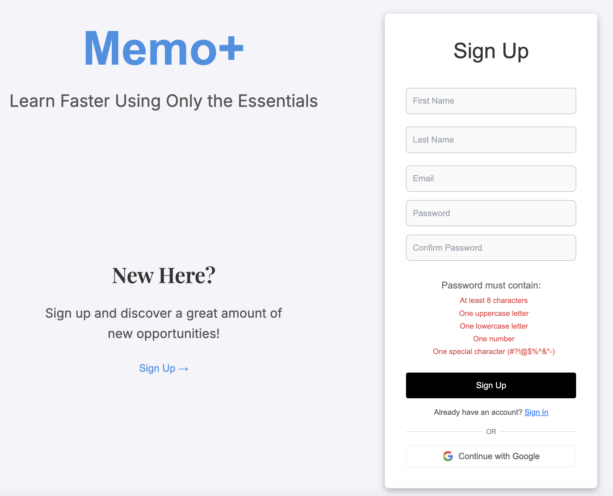

# Memo+ Study Group Application

A collaborative learning platform that allows users to create and join study groups, make flashcards, take tests, and communicate in real-time.

## Prerequisites

Before you begin, ensure you have installed:
- Node.js (v16.0.0 or higher)
- npm (v8.0.0 or higher)
- Git

## Installation

1. Clone the repository:
```bash
git clone https://github.com/majid-iqbal1/firebase-project.git
cd firebase-project
```

2. Install dependencies:
```bash
npm install
```

3. Create a `.env` file in the root directory and add your Firebase and EmailJS configuration:
```env
REACT_APP_apiKey=your_firebase_api_key
REACT_APP_authDomain=your_firebase_domain
REACT_APP_projectId=your_project_id
REACT_APP_storageBucket=your_storage_bucket
REACT_APP_messagingSenderId=your_messaging_id
REACT_APP_appId=your_app_id

REACT_APP_EMAILJS_SERVICE_ID=your_emailjs_service_id
REACT_APP_EMAILJS_TEMPLATE_ID=your_emailjs_template_id
REACT_APP_EMAILJS_PUBLIC_KEY=your_emailjs_public_key
```

4. Start the development server:
```bash
npm start
```

## Dependencies

Core Dependencies:
- React (v18.3.1)
- React Router DOM (v6.28.0)
- Firebase (v11.0.1)
- EmailJS Browser (v4.4.1)
- Lucide React (v0.456.0)

Development Dependencies:
- Autoprefixer (v10.4.20)
- PostCSS (v8.4.47)

## Features and Usage Guide

### Authentication
1. **Sign Up**
   - Click "Sign Up" on the landing page
   - Enter your name, email, and password
   - Or use Google Sign-in
   

2. **Sign In**
   - Enter your email and password
   - Or use Google Sign-in
   [Add screenshot]

### Flashcards
1. **Create Flashcard Set**
   - Click "+" button > "Flashcard set"
   - Enter title and description
   - Add terms and definitions
   - Click "Create" or "Create and practice"
   [Add screenshot]

2. **Study Flashcards**
   - Navigate to "Your Library"
   - Select a flashcard set
   - Click "Study" to begin
   [Add screenshot]

### Study Groups
1. **Create Group**
   - Click "+" > "Study Group"
   - Fill in group details
   - Add group image (optional)
   - Set privacy settings
   [Add screenshot]

2. **Join Group**
   - Go to "Join Groups"
   - Search for groups
   - Click "Join" on desired group
   [Add screenshot]

### Tests
1. **Create Test**
   - Click "+" > "Test"
   - Add questions and answers
   - Import from flashcards (optional)
   [Add screenshot]

2. **Take Test**
   - Select test from Tests page
   - Answer questions
   - View results
   [Add screenshot]

### Group Chat
- Access group chat from group page
- Share resources and files
- Schedule events
[Add screenshot]

## Contributing

1. Fork the repository
2. Create your feature branch (`git checkout -b feature/AmazingFeature`)
3. Commit your changes (`git commit -m 'Add some AmazingFeature'`)
4. Push to the branch (`git push origin feature/AmazingFeature`)
5. Open a Pull Request

## License

All right reserved

## Authors
- Majid Iqbal
- Sulav Shakya
- Bruce Duong
- Ethan Humrich

## Acknowledgments
- UW Bothell CSS 481 Course